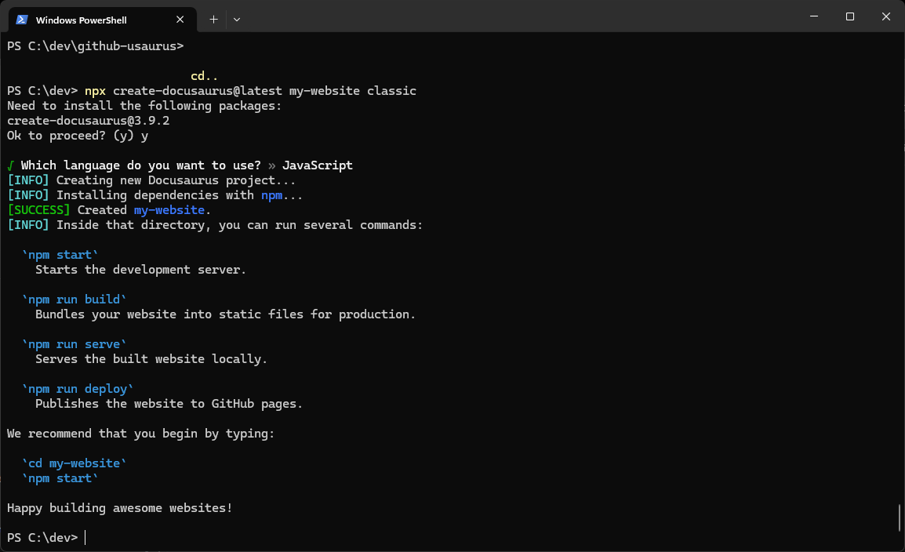

# Introduction

This tutorial is for users who want to use Docusaurus for simple tasks such as content publication. It assumes you have knowledge of:

- Software installation
- Git and local repositories
- GitHub User Interface (UI)
- Command line interfaces (PowerShell or similar)
- Text file editing 

After completing this task, you will be able to:

- Create an instance of a Docusaurus website on your computer.
- Create a new GitHub repository (repo) for hosting the Docusaurus web site online.
- Connect the local Docusaurus project to the new GitHub repo.
- Configure Docusaurus to deploy to GitHub pages.
- Deploy your Docusaurus website to GitHub.
- View your published site on GitHub.

## Background

Docusaurus is an open-source static website generator. It enables you to build websites quickly and easily. Integrating Docusaurus with GitHub creates a simple to maintain content repository, particularly useful for building and maintaining documentation. 

## Before you start 

Install the following software:

- Git for your operating system 
- Node.js v14 or later (Long Term Support version)
- Yarn package manager
- Docusaurus
- Your preferred code editor, such as Notepad, Visual Studio Code (VSC) or similar

You should also have configured Git to work with a Personal Access Token. For more information on generating and configuring Personal Access tokens, see https://docs.github.com/en/authentication/keeping-your-account-and-data-secure/managing-your-personal-access-tokens#creating-a-personal-access-token-classic. 

## Create a Docusaurus website.

1. Press **Start**, type **PowerShell** and press **ENTER**.

2. Navigate to the local folder under which you want to create your Docusaurus project, for example, `C:\dev`. 

3. **Type** `npx create-docusaurus@latest my-website classic`, where `my-website` is the name of your new Docusaurus website.

## Create a new repo in GitHub to host the site

## Connect the local Docusaurus project to GitHub

## Configure Docusaurus for deployment to GitHub Pages

## Create the gh-pages branch required for deployment

## Deploy the site using yarn deploy

## Check GitHub Pages enabled in repository settings

## View the published site on GitHub Pages URL

## Summary

In this tutorial, you've now seen how to:

- Set up Docusaurus
- Summary point 2
- Summary point 3

## Next steps

[Use this section to share links to related tutorials, videos, or other documentation].

Consider completing some other common tasks using [feature]:

- Task 1
- Task 2
- Task 3
