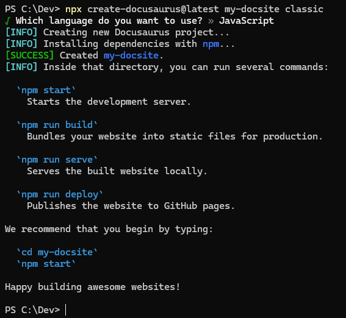
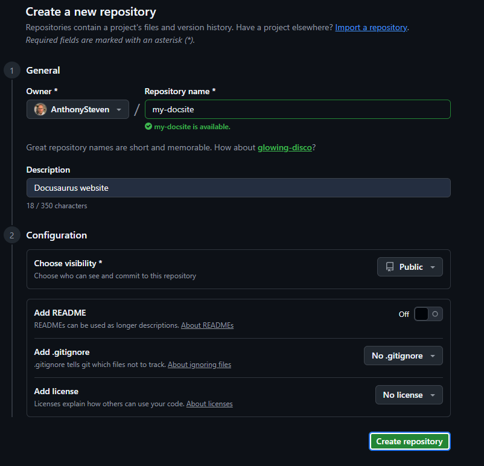
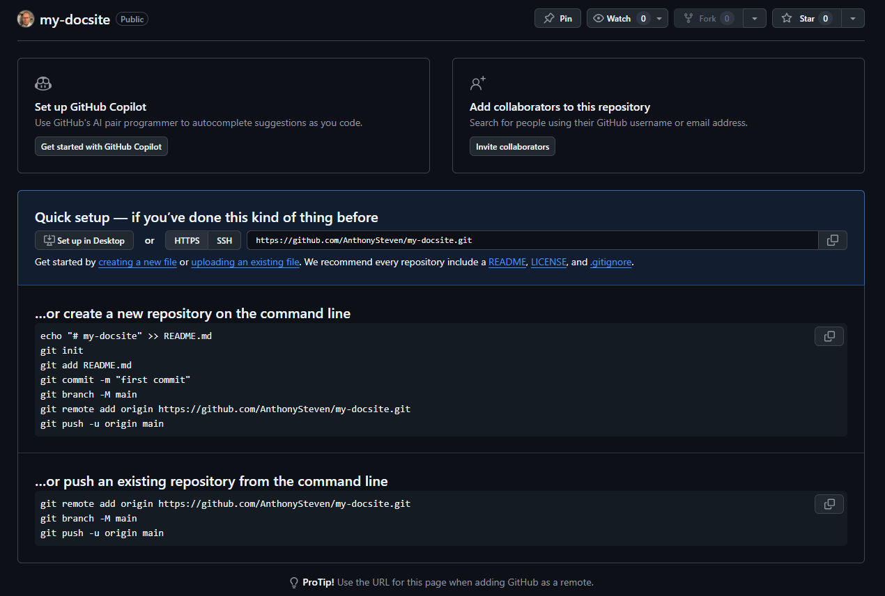
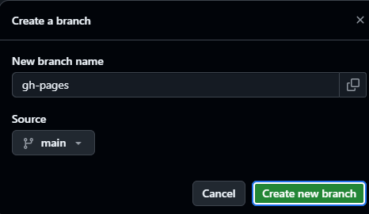

# Introduction

This process enables you to integrate Docusaurus with GitHub for simple tasks such as content publication. After you complete this task, you will be able to:

- Create an instance of a Docusaurus website on your computer.
- Create a new GitHub repository (repo) for hosting the Docusaurus web site online.
- Connect a local Docusaurus project to the new GitHub repo.
- Configure Docusaurus to deploy to GitHub Pages.
- Deploy your Docusaurus website to GitHub.
- View your published site on GitHub.

## Background

Docusaurus is an open-source static website generator that enables you to build websites quickly and easily. Integrating Docusaurus with GitHub creates a simple-to-maintain content repository, particularly useful for building and publishing online documentation. 

## Before you start 

Install the following software:

- Git (for your operating system), at https://git-scm.com/install/  
- Node.js v20.0 or later, at https://nodejs.org/en/download/ (Long Term Support version)
- npm, installed with Node.js
- Yarn package manager (installed using npm)
- Docusaurus (installed using npm)
- Your preferred code editor, such as Notepad, Visual Studio Code (VSC) or similar

You should also have configured Git to work with a Personal Access Token. For more information on generating and configuring Personal Access tokens, see https://docs.github.com/en/authentication/keeping-your-account-and-data-secure/managing-your-personal-access-tokens#creating-a-personal-access-token-classic. 

These instructions assume you have knowledge of:

- Software installation
- Git and local repositories
- GitHub User Interface (UI)
- Command line interfaces (PowerShell or similar)
- Text file editing 

## Create a new local Docusaurus website

1. Press **Start**, type **PowerShell** and press **Enter**.

2. Navigate to the local folder under which you want to create your Docusaurus project, for example, `C:\dev`. 

>**Note:** Don't use OneDrive folders (for example, `Documents`) for local Git instances. OneDrive file locking is incompatible with Git. 

3. Create the Docusaurus local website, where `my-docsite` is the name of your new Docusaurus website:

```
npx create-docusaurus@latest my-docsite classic
```

4. At the **Which language do you want to use?** prompt, select `JavaScript` and press **Enter**. 

5. The output should be similar to this screenshot: 



6. Leave the command-line window open on your desktop. 

## Create a new repo in GitHub to host the Docusaurus site

1. Open a browser and log into your GitHub account. 

2. On the GitHub **Overview** page, click **Repositories**.

3. On the **Repositories** page, click **New**.

4. Under **Create a new repository**, in the **Repository Name** field, type **my-docsite**. Ensure this name uses only lower-case letters, numbers and hyphens. 

5. Type a friendly description to help you remember the purpose of this repo, such as **Docusaurus website**.

6. Under **Configuration**, select the following options:

- **Choose Visibility** - **Public**
- **Add README** - **Off**
- **Add .gitignore** - **No .gitignore**
- **Add license** - **No license**



> **Note:** Docusaurus includes the files it needs, so you don’t need README, .gitignore, or licence files.

7. Click **Create repository**. 

8. You'll now see your new repository in GitHub. Leave the browser window open. 



## Connect the local Docusaurus project to GitHub

1. Switch back to your PowerShell or preferred command-line environment. 

2. Type `cd my-docsite` and press **Enter** to change to the `my-docsite` folder.

3. Initialise the Git environment.

```
git init
```

4. Add all project files to the initial commit:

```
git add .
```

> **Note:** You will see some warnings about LF and CRLF. You can ignore these warnings for this task. 

5. Make the initial commit:

```
git commit -m "Initial commit"
```

You should see a series of **Create mode** messages. 

6. Add your GitHub repository as a remote. 

```
git remote add origin https://github.com/<github-username>/my-docsite.git
```
>**Note:** Replace <github-username> with your GitHub user name. 

7. Check git configuration:

```
git remote -v
```
8. You should see the following status messages for **fetch** and **push**. 


9. Set the branch name to `main`:

```
git branch -M main
```
10. Push the project to GitHub:

```
git push -u origin main
```

11. Switch back to your browser window and press **F5** to refresh. The repo should resemble this screenshot:


Leave your browser window open. 

## Configure Docusaurus for deployment to GitHub Pages

1. Using your preferred code editor, navigate to `C:\dev\my-docsite` and open `docusaurus.config.js`.

2. Locate the following lines:

- url
- baseUrl
- organizationName
- projectName

3. Replace the existing variables with ones that match your naming convention:

```
url: 'https://<github-username>.github.io',
baseUrl: '/my-docsite/',
organizationName: '<github-username>',
projectName: 'my-docsite',

```
This screenshot shows the changed settings in VSC:


## Manually create the gh-pages branch

Docusaurus expects to find a branch called `gh-pages`. You can create this branch manually in the GitHub UI. Alternatively, you can use the command line. 

1. Switch to the browser window displaying the `my-docsite` repo. 

2. In the ribbon underneath **my-docsite** and next to **main**, click **1 Branch**. 

3. In the **Branches** page, click **New branch**.

4. In the **Create a branch** dialog box, under **New branch name**, type `gh-pages`. 

5. Check that **Source** is set to **main**, then click **Create new branch**. 

 

6. Your new branch should appear in the **Branches** page.

## Deploy the Docusaurus site using yarn

1. Switch back to your preferred command-line interface.

2. Configure the GIT_USER environment variable:

```
$env:GIT_USER="<github-username>"
```

3. Check that you are in the project folder, for example, `C:\dev\my-docsite`.

4. Deploy the site:

```
yarn deploy
```
This screenshot shows the expected output:

 

5. Note the `Website is live at https://<github-username>.github.io/my-docsite/` message. 

## View the published site on GitHub Pages

1. Copy the `https://<github-username>.github.io/my-docsite/` link and paste it into a new browser tab.

2. You can now view the deployed Docusaurus site on GitHub.

 

## Summary

In this tutorial, you:

- Set up a new Docusaurus site.
- Created a new GitHub repo.
- Connected the Docusaurus project to the GitHub repo.
- Configured Docusaurus to deploy to GitHub Pages.
- Deployed the Docusaurus website to GitHub.
- Checked that the Docusaurus site displays correctly. 

## Next steps

- Troubleshoot Docusaurus error messages
- Configure trailing slashes in `docusaurus.config.js`
- Generate a Personal Access Token
- Update Docusaurus content and rebuild the website
